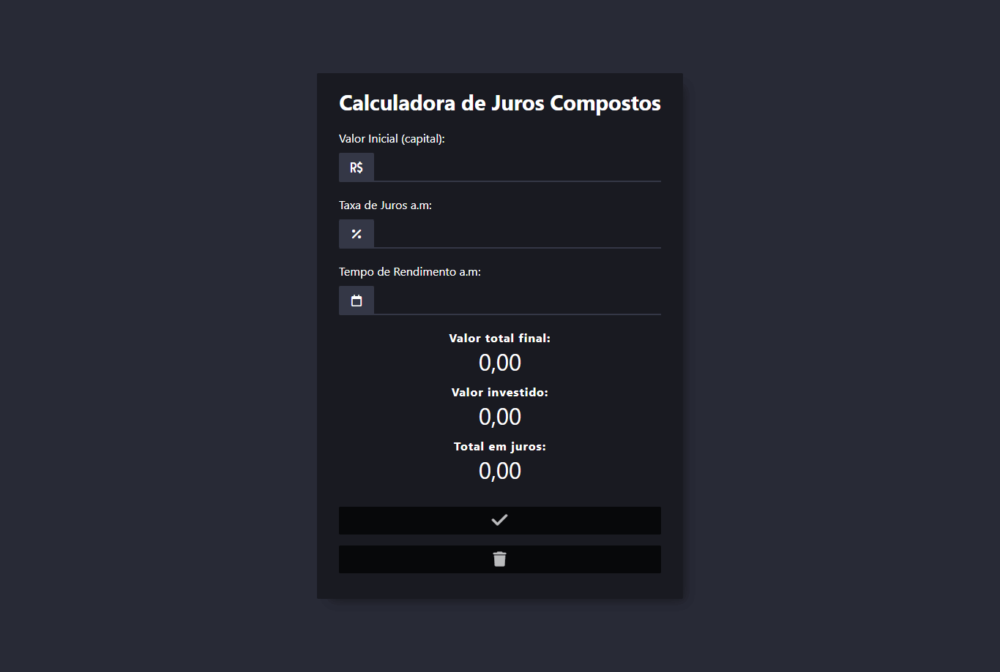

<h1 align="center">
  Calculadora de Juros Compostos
</h1>

  

## Projeto - Calculadora de Juros Compostos

Este projeto é amigável, possui estilos atraentes e uma estrutura bem organizada, além de seguir o padrão clean code. Permite calcular juros compostos com facilidade.

Tecnologias Utilizadas:
* [HTML (Linguagem de marcação):](https://www.w3schools.com/html/html_intro.asp) Utilizado para estruturar e definir o conteúdo da página, incluindo cabeçalhos, parágrafos, listas e imagens.
* [CSS (Folha de estilos em cascata):](https://www.w3schools.com/css/css_intro.asp) Utilizado para estilizar os elementos da página, definindo cores, tamanhos, fontes e layout, proporcionando uma aparência visualmente atraente.
* [JavaScript:](https://developer.mozilla.org/pt-BR/docs/Web/JavaScript) Utilizado para adicionar interatividade à página, permitindo que o usuário selecione personagens e exiba informações dinamicamente.
* [Font Awesome:](https://fontawesome.com/) É uma biblioteca que oferece uma ampla variedade de ícones personalizados prontos para serem utilizados em sites e aplicativos.
* [Vercel:](https://vercel.com/) É uma plataforma que oferece hospedagem para sites estáticos, implantação para aplicativos web, suporte a funções serverless, integração contínua e compatibilidade com uma ampla variedade de ferramentas de desenvolvimento.

Créditos:
* Criado por minha autoria | [José Carlos • jcddsj01](https://github.com/jcddsj01)

Implantação do Projeto no Vercel: [Explore o projeto clicando aqui.](https://calculadora-juros-compostos-v1.vercel.app/)

---

## Project - Compound Interest Calculator

This project is user-friendly, has attractive styles and a well-organized structure, as well as following the clean code standard. It allows you to calculate compound interest easily.

Technologies used:
* [HTML (HyperText Markup Language):](https://www.w3schools.com/html/html_intro.asp) Used to structure and define page content, including headings, paragraphs, lists and images.
* [CSS (Cascading Style Sheets):](https://www.w3schools.com/css/css_intro.asp) Used to style the elements of the page, defining colors, sizes, fonts and layout, providing a visually appealing appearance.
* [JavaScript:](https://developer.mozilla.org/pt-BR/docs/Web/JavaScript) Used to add interactivity to the page, allowing the user to select characters and display information dynamically. 
* [Font Awesome:](https://fontawesome.com/) It's a library that offers a wide variety of customized icons ready to be used on websites and applications.
* [Vercel:](https://vercel.com/) It is a platform that offers hosting for static sites, deployment for web applications, support for serverless functions, continuous integration and compatibility with a wide variety of development tools.

Credits:
* Created by me | [José Carlos • jcddsj01](https://github.com/jcddsj01)

Project deployment on Vercel: [Explore the project by clicking here.](https://calculadora-juros-compostos-v1.vercel.app/)
